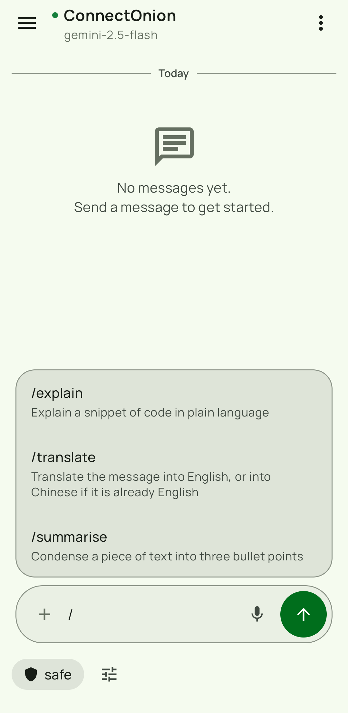
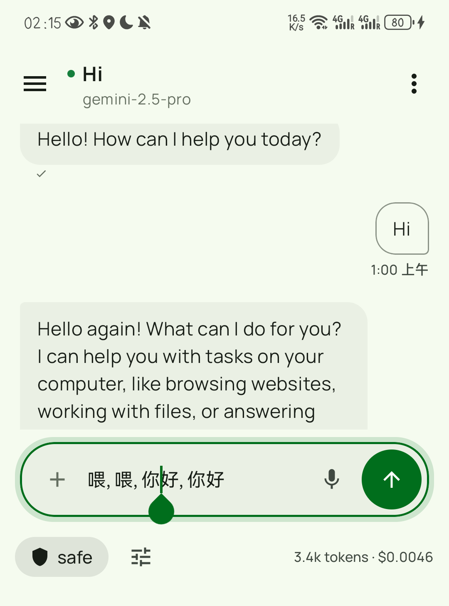
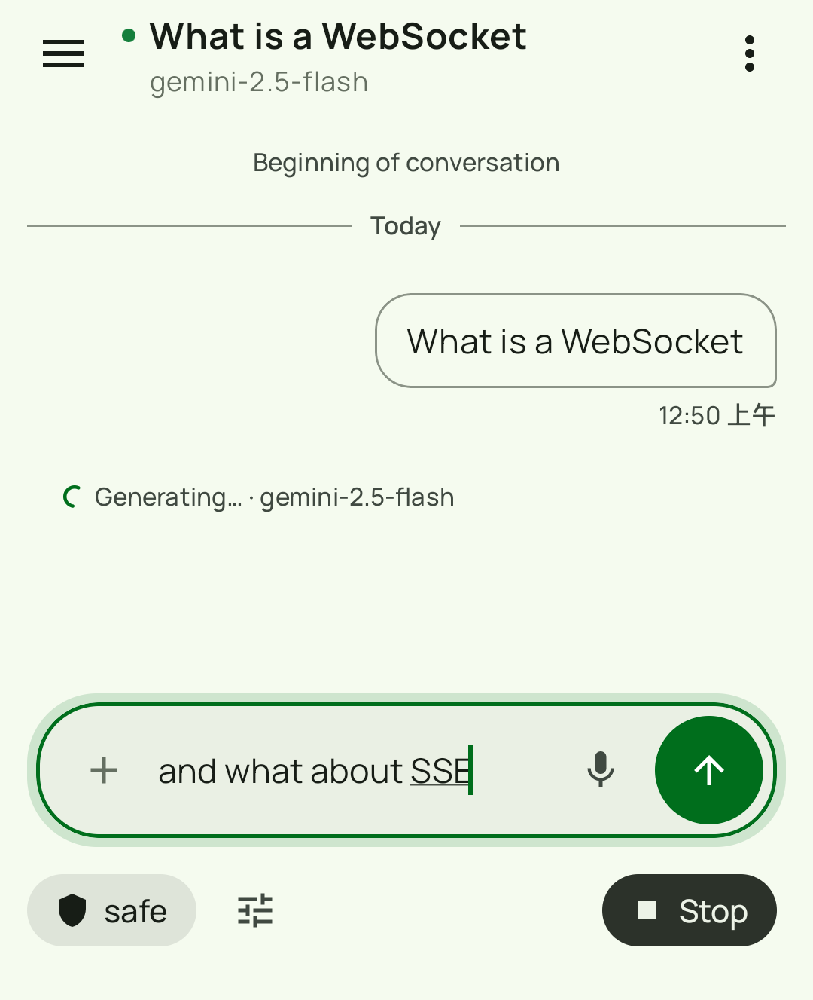
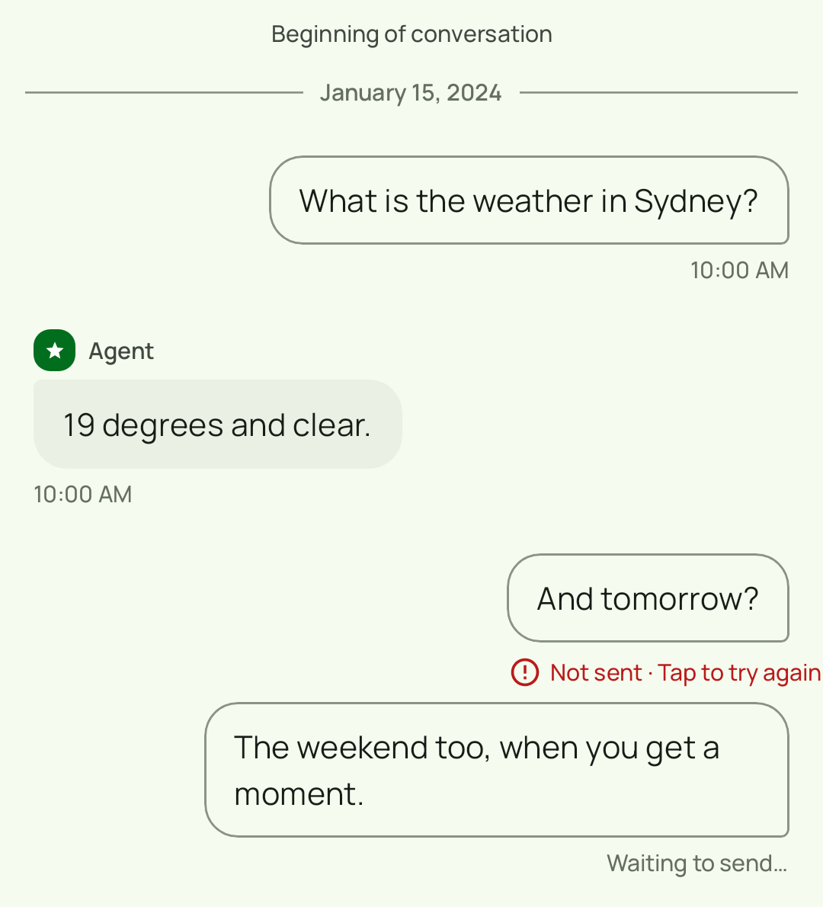
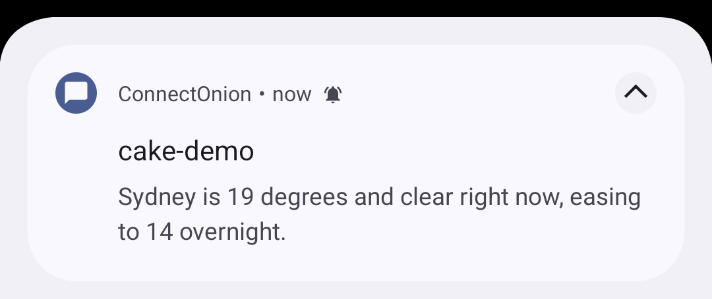

# oochat for Android

[](https://github.com/openonion/oochat-android/actions/workflows/build.yml)
[](https://github.com/openonion/oochat-android/actions/workflows/audit.yml)

Native Android chat client for [ConnectOnion](https://docs.connectonion.com/)
agents, built with Kotlin and Jetpack Compose. Connect to an agent by its `0x…`
address and talk to it — the same protocol the
[web client](https://github.com/openonion/oo-chat) speaks.

## Who this is for

This is a starting point, not a finished product you are meant to use as-is.

If you are running ConnectOnion agents and your users want a native Android app
rather than a browser tab, fork this, change the four things under
[Make it yours](#make-it-yours), and ship it. The web client is the default
answer; this exists for when the default is not enough.

## What it does

### Slash-command palette

Type `/` in the composer and the agent's published skills appear as a list, each
with the description the agent gave it. The list comes from the agent itself — an
agent that publishes nothing shows an empty palette rather than a stale or
invented one.



### Dictation lands in the composer, not in the chat

Speak instead of typing and the transcript arrives **in the text field**, where
you can fix a misheard word before anything is sent. A recogniser that mishears a
name no longer costs you a message.



### Keep typing while the agent is working

The composer stays usable while a reply is streaming, so a follow-up or a
correction can be sent mid-run. The agent picks it up as part of the same turn.

This needs `runtime_input` on the agent, which is opt-in
(`Agent(plugins=[runtime_input])`). Without it the relay acknowledges the
mid-run message and queues it, and nothing drains the queue.



### A message that did not send says so

Failed sends are marked and can be retried, rather than disappearing into the
transcript as though they had gone.



### Replies reach you when you are elsewhere

A notification arrives when a reply lands and the app is in the background.



### And the rest

- Multiple sessions per agent, in a drawer, renameable
- Agent discovery and invite-code onboarding
- **BIP39 recovery phrase** — generated the same way as the web client, so a
  phrase created in one restores the identical identity in the other
- Ed25519 signing via lazysodium; credentials in EncryptedSharedPreferences
  (AES256-GCM)
- Room-backed history: agents, sessions, messages, session state

### What it does not do

- No tablet-specific layout — it runs on tablets, but the layout is the phone one
- Mid-run input needs the agent to opt in (see above)
- Instrumented UI tests need an attached device; CI does not run them

## Requirements

| | |
|---|---|
| Android | 8.0 (API 26) or later |
| Build | JDK 17, Android SDK with the API 36 platform |
| Android Studio | Hedgehog (2023.1.1) or newer |
| An agent | See [connectonion](https://github.com/openonion/connectonion) — `pip install connectonion`, then `co init` |

## Build and run

```bash
git clone https://github.com/openonion/oochat-android.git
cd oochat-android

./gradlew :app:assembleDebug        # build
./gradlew :app:installDebug         # install on a connected device or emulator
./gradlew :app:testDebugUnitTest    # unit tests
./gradlew :app:jacocoTestReport     # coverage
```

Instrumented and Compose UI tests need a device attached:

```bash
./gradlew :app:connectedDebugAndroidTest
```

Screenshot baselines are checked with
[Roborazzi](https://github.com/takahirom/roborazzi):

```bash
./gradlew :app:verifyRoborazziDebug
```

> **The committed baselines are stale and CI does not check them.** A fixture in
> `SettingsScreenshotTest` was changed during the rebrand, so the baseline images
> no longer match what the test renders, and `verifyRoborazziDebug` is not run in
> CI. Nothing else covers this either — baselines are PNGs, and the
> pre-publication audit does not read images. Regenerate them with
> `./gradlew :app:recordRoborazziDebug` on a machine with the Android SDK before
> relying on screenshot coverage.

See [INSTALL.md](INSTALL.md) for a clean-machine walkthrough and
[USER_GUIDE.md](USER_GUIDE.md) for the app itself.

## Configure

| What | Where | Default |
|---|---|---|
| Relay endpoint | In-app settings | `oo.openonion.ai` |
| Agent address | Added in-app by `0x…` address | — |

## Make it yours

| # | What | Where |
|---|---|---|
| 1 | Application ID | `app/build.gradle.kts` — currently `ai.openonion.oochat` |
| 2 | Display name | `app/src/main/res/values/strings.xml` |
| 3 | Icon | `app/src/main/res/mipmap-*` |
| 4 | Relay endpoint | In-app settings, or the default in `Constants.kt` |

## Architecture

Compose UI over view models over a repository layer, with the WebSocket protocol
client underneath. `ui/` renders, `domain/` holds the models, `data/` owns Room
and the preference stores, `network/` owns the relay connection, and `crypto/`
owns the Ed25519 identity and BIP39 recovery.

An architecture test (`ArchitectureGuardTest`) enforces the layering: UI code
cannot import repository implementations, DAOs, or the WebSocket factory
directly. If you restructure, that test is where the rules are written down.

See [docs/architecture.md](docs/architecture.md) and
[docs/protocol.md](docs/protocol.md).

## Contributing

Issues and pull requests are welcome at
<https://github.com/openonion/oochat-android>.

## License

MIT — see [LICENSE](LICENSE).

Copyright (c) 2026 ConnectOnion PTY LTD.
