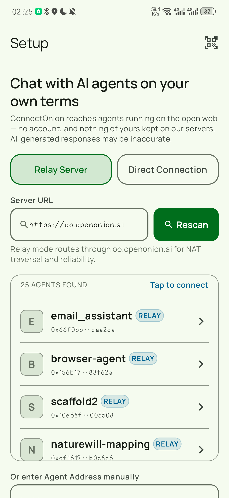
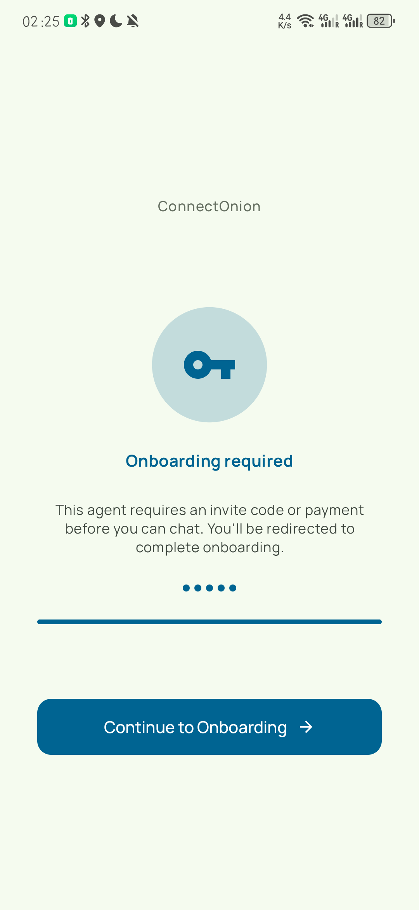
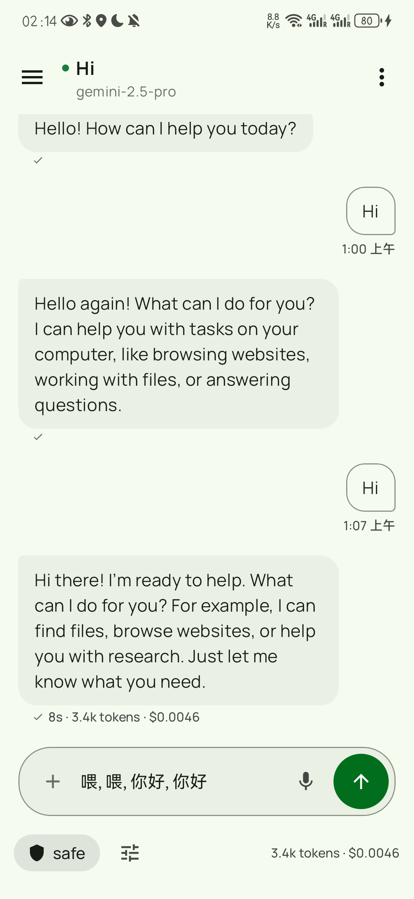
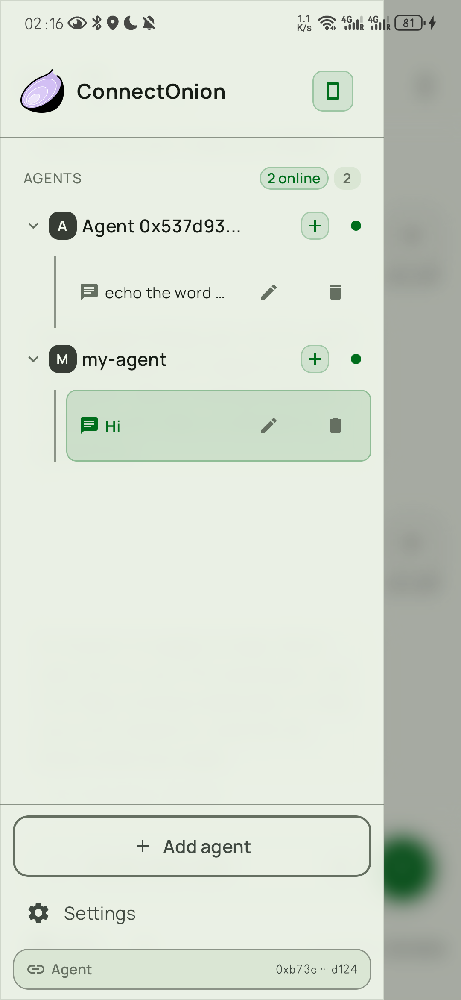
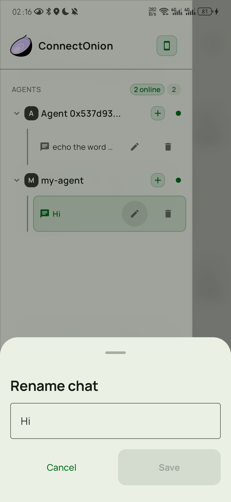

# ConnectOnion for Android — User Guide

This is the guide for using the app. For installing it see
[`INSTALL.md`](INSTALL.md); for how it is built see [`README.md`](README.md).

ConnectOnion lets you talk to AI agents that run somewhere else — on a
developer's laptop, on a server, on someone's Raspberry Pi — from your phone.
There is no account to create. The app makes an identity for you on first
launch and keeps it on the device.

---

## 1. Connecting to an agent

On first launch you land on **Setup**. It scans the default relay and lists the
agents currently online.

**The quickest way in is to tap one.** The list is live; agents come and go as
their owners start and stop them.

If you were given an address instead, scroll to **Or enter Agent Address
manually** and paste it. An address is `0x` followed by 64 hex characters. The
QR button in the top right scans one from a screen or a printout.

**Relay Server or Direct Connection.** Leave it on *Relay Server* unless you
were told otherwise — the relay handles agents behind home routers, which is
most of them. *Direct Connection* is for an agent you can reach on the network
yourself, and it asks for that agent's own URL instead of the relay's.

### If the agent asks for an invite code

Some agents are not open to everyone. Tap **Continue to Onboarding** and enter
the code you were given. Nothing is charged without asking you first.

---

## 2. Having a conversation

Type in the box at the bottom and send. The agent's reply arrives in the
transcript, and under each reply is a line like:

> ✓ 8s · 3.4k tokens · $0.0046

That is how long the agent took, how much of its context the exchange used, and
what it cost — the agent's owner pays this, not you, unless you have supplied
your own key.

**While the agent is working**, a **Stop** chip appears. Stop is a request, not
a kill switch: the agent finishes the step it is on and sends a closing message,
so expect one more line after you press it.

**You do not have to wait.** Keep typing while a reply is still coming.

A message typed mid-answer waits for the current turn and goes out when it
ends, so nothing is lost and nothing interrupts.

---

## 3. Slash commands

Some agents publish named skills. Type `/` to see them.

Each entry shows the description the agent gave it, so you do not have to guess
what a command does or how it is spelled. **An empty palette is not a fault** —
it means this agent publishes no skills, which many do not.

---

## 4. Speaking instead of typing

Tap the microphone and talk. What you said lands **in the text box** rather than
being sent.

Nothing is sent until you press send, so you can fix a misheard word first.

The first dictation on a phone may pause a second or two on **Preparing…**
while the app works out whether the phone's own speech recogniser can be used.
If it cannot, the app records and has the audio transcribed instead — you get
the same editable text, just only once you stop talking rather than as you
speak. Either way the audio is not stored and not sent anywhere else.

> On an emulator, dictation is not worth judging: the microphone is the host
> machine's and what the emulator reports about it does not match a phone.

---

## 5. Attaching a photo or a file

The **+** at the left of the composer offers the camera, your gallery and a file
picker. Up to three attachments per message. Images are compressed on the device
before they are sent.

---

## 5a. An agent's own Home page

Some agents send the app a page of their own — a status board, a form, a set of
shortcuts, whatever their author built. When one does, a **grid icon appears in
the top bar** beside the agent's name; tap it to open the page, and use back to
return to the chat.

The page is the agent's, not the app's, so what it contains is up to whoever
wrote the agent. It is displayed in a locked-down view: it cannot reach the
network, cannot store anything, and cannot navigate anywhere. If no icon
appears, this agent has not sent one.

---

## 6. Deciding what the agent may do

Agents that can edit files or run commands ask permission first. The chip at the
bottom left sets how often they have to ask:

| Mode | What it means |
|---|---|
| **Safe** | Ask before file edits and commands. The default, and the one to stay on. |
| **Plan** | The agent works out what it would do and shows you, without doing it. |
| **Accept edits** | Edit files without asking. Commands still ask. |
| **Ultra work** | Fully autonomous, for a set number of turns that you choose. |

**Ultra work is fenced off deliberately** — it carries a warning and a turn
budget, and the app drops back to Safe when the budget runs out. Use it when you
are watching, not when you are away.

When a permission card appears you can **Allow once**, **Trust for this
session**, **Reject**, or ask the agent to **Explain** what it is about to do.

---

## 7. Conversations

Open the drawer with the ☰ button. Every agent you have used has its own list of
chats under it.

- **+** beside an agent starts a new chat with it.
- Tap a chat to reopen it. History is kept on the device and survives the app
  being closed or killed.
- The **pencil** renames a chat.
- The **bin** deletes one, after asking.

Renaming is worth doing once a list of chats stops being distinguishable by its
opening line.

---

## 8. Managing agents

**Settings → Agent List** holds the agents you have saved.

- **Add** one by address, or find one with **Discover**.
- **Drag** the handle to reorder.
- The **⋮** menu on each row sets it as default, edits it, or removes it.
- The default agent is the one the app opens on.

Editing an agent asks for a name, a server URL and the agent's address. An
address that is not `0x` plus 64 hex characters is rejected with a message
rather than saved.

---

## 9. Being told about a reply while you are elsewhere

**Settings → Notifications**, off by default. With it on, a reply that arrives
while you are in another app posts a notification; tapping it brings you back.

There is a real limit worth knowing. The app can only notice a reply while it
still holds its connection, and Android suspends that connection for apps in the
background — on some phones within seconds. So this covers stepping away
mid-answer, not closing the app and coming back an hour later. The sound is
Android's own, on the app's notification channel, which the same Settings row
opens.

---

## 10. Settings

| | |
|---|---|
| **Appearance** | Light, dark, or follow the system. |
| **Show live progress** | Whether thinking and tool steps appear as they happen, or only the finished reply. |
| **Render Markdown** | Formatted replies, or plain text. |
| **Font size** | Four steps — Small, Medium, Large, Extra Large — previewed live. Combines with the system font size rather than overriding it. |
| **Haptic feedback** | The small vibration when a message is sent. |
| **Sound effects** | The in-app tones for sending and receiving. Separate from notifications. |
| **Memory** | Whether an agent sees context carried over from your other chats with it. Off means each chat starts clean. |
| **Custom instructions** | Text quietly prepended to everything you send — a standing "answer briefly", say. |
| **Push notifications** | Section 9. |
| **Notification sound** | Opens Android's own settings for this app's notification channel, where the full system sound list lives. |
| **Agent List** | Section 8. |
| **Logs** | The app's own log, for reporting a problem. |
| **Delete all conversations** | Exactly that, for every agent. It asks first. |
| **Clear connection data** | Forgets the saved server and agent so the app starts from Setup again. Your conversations are kept — this is not the same as the row above. |
| **Terms & Privacy**, **Version** | Under About. |

**Account** is also here: your wallet address, a **recovery phrase** you can
write down, **Import Key** to restore an identity onto a new phone, and **Reset
Identity**, which discards the current one. Without the recovery phrase a reset
or a wiped phone means a new identity and no way back to the old one.

Conversations and attachments are stored on the device. Voice recordings are
never saved.

---

## 11. When something goes wrong

**"Waiting to send…" under a message.** You are offline. It is queued on the
device and goes out by itself when the connection returns — including after the
app is killed.

**"Not sent · Tap to try again" in red.** The message did not leave the device.
Tap it to send it again; it keeps its place in the conversation.

**A reply says "Failed" with a Retry button.** The agent's turn ended without an
answer, usually a dropped connection. Retry asks again.

**The banner says the connection failed.** The app reconnects on its own, with
increasing gaps, and gives up after five tries. **Reconnect** on the banner
starts over. If nothing happens when you tap it, the saved configuration has
been cleared — add an agent again in Settings.

**"This agent is offline."** The relay is fine and the agent is not running.
Only its owner can start it.

**"Can't reach this server."** Your network or the relay. Note that a phone on a
café or campus wifi that needs a sign-in page will look online to the app while
nothing gets through — if a connection fails on a network like that, open a
browser first and complete the sign-in.

**The app recovers to a screen offering Retry and Edit configuration.** That is
what a failed start looks like. Edit configuration takes you back to Setup.

---

## What this app deliberately does not do

- **It does not hold an account for you.** Your identity is a key pair made on
  the device — see Account in §10 for the recovery phrase, which is the only
  thing that can move it to another phone.
- **It does not run the agents.** They belong to whoever started them, and the
  app cannot start, stop or fix one.
- **It does not send your conversations anywhere but the agent** you are talking
  to. They are not backed up off the device, which also means they do not follow
  you to a new phone.
